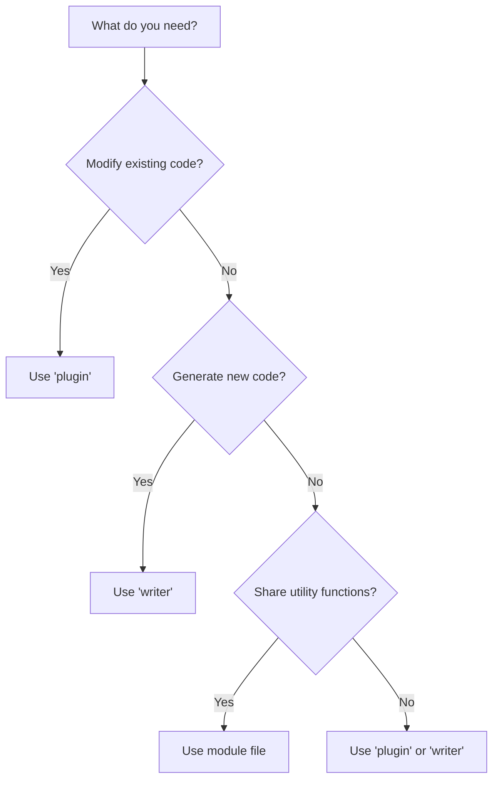

# Babel Plugin to ReluxScript Conversion Guide

A comprehensive guide for converting Babel plugins to ReluxScript - the dual-target language that compiles to both Babel (JavaScript) and SWC (Rust) plugins.

::: tip Why ReluxScript?
Write your plugin once, run it on both Babel and SWC platforms. Get JavaScript compatibility AND native Rust performance.
:::

## Table of Contents

[[toc]]

---

## ReluxScript File Types

ReluxScript has three types of files, each serving a different purpose:

### Plugin vs Writer vs Module

| Type | Purpose | Has Visitors? | Transforms AST? | Outputs Code? |
|------|---------|---------------|-----------------|---------------|
| **`plugin`** | Transform AST in-place | ✅ Yes | ✅ Yes | ❌ No |
| **`writer`** | Generate code from AST | ✅ Yes (read-only) | ❌ No | ✅ Yes |
| **Module** | Reusable functions | ❌ No | ❌ No | ❌ No |

### Plugin Files

**Purpose:** Transform the AST directly (like standard Babel plugins)

**Use when:** You want to modify JavaScript/TypeScript code

**Example:**
```reluxscript
// transform-hooks.lux
plugin HookTransformer {
    fn visit_call_expression(node: &mut CallExpression, ctx: &Context) {
        // Modify the AST - transform useState to useCustomState
        if let Expression::Identifier(ref mut id) = node.callee {
            if id.name == "useState" {
                id.name = "useCustomState";  // AST is modified!
            }
        }
    }
}
```

**Compiles to:**
- **Babel:** Standard visitor that uses `path.replaceWith()`, `path.remove()`, etc.
- **SWC:** `VisitMut` implementation that modifies nodes in-place

**Key characteristics:**
- Visitor methods receive `&mut NodeType` (mutable references)
- Can modify, replace, or remove nodes
- No return value - transformations happen in-place
- Output is the transformed AST (which becomes transformed code)

### Writer Files

**Purpose:** Read the AST and generate output code (transpilers/code generators)

**Use when:** You want to convert code to a different language (React → C#, etc.)

**Example:**
```reluxscript
// react-to-csharp.lux
writer ReactToCSharp {
    struct State {
        output: String,
    }

    fn init() -> State {
        State { output: String::new() }
    }

    fn visit_function_declaration(node: &FunctionDeclaration, ctx: &Context) {
        // Read the AST and generate C# code
        if let Some(ref id) = node.id {
            self.state.output.push_str(&format!("public class {} {{\n", id.name));

            // Visit children to process body
            node.visit_children(self);

            self.state.output.push_str("}\n");
        }
    }

    fn visit_call_expression(node: &CallExpression, ctx: &Context) {
        // Generate C# for useState → field declaration
        if let Expression::Identifier(ref id) = node.callee {
            if id.name == "useState" {
                self.state.output.push_str("    private dynamic _state;\n");
            }
        }
    }

    fn finish(self) -> String {
        self.state.output
    }
}
```

**Compiles to:**
- **Babel:** Visitor with string builder that returns generated code in `post()` hook
- **SWC:** `Visit` (read-only) implementation that accumulates output

**Key characteristics:**
- Visitor methods receive `&NodeType` (immutable references - read-only!)
- Cannot modify the AST
- Accumulates output in `state` (usually a `String` or `CodeBuilder`)
- Has lifecycle methods: `init()` (setup) and `finish()` (return output)
- Returns generated code as a string

### Module Files

**Purpose:** Reusable helper functions and types (no visitors)

**Use when:** You want to share utility code between plugins/writers

**Example:**
```reluxscript
// helpers.lux
pub struct ComponentInfo {
    pub name: Str,
    pub props: Vec<PropInfo>,
}

pub struct PropInfo {
    pub name: Str,
    pub type_name: Str,
}

pub fn getComponentName(node: &FunctionDeclaration) -> Option<Str> {
    if let Some(ref id) = node.id {
        Some(id.name.clone())
    } else {
        None
    }
}

pub fn isComponentName(name: &Str) -> bool {
    if name.is_empty() {
        return false;
    }
    name.chars().next().unwrap().is_uppercase()
}

pub fn escapeCSharpString(s: &Str) -> Str {
    s.replace("\\", "\\\\")
     .replace("\"", "\\\"")
     .replace("\n", "\\n")
}
```

**Compiles to:**
- **Babel:** CommonJS module with exported functions
- **SWC:** Rust module with public functions

**Key characteristics:**
- No visitor methods
- Just functions, structs, and enums
- Exported with `pub` keyword
- Imported with `use` statements
- Pure logic - no AST traversal

### Choosing the Right Type



**Examples:**

| Task | File Type | Example |
|------|-----------|---------|
| Remove console.log calls | `plugin` | Transform AST to remove nodes |
| Convert React → C# | `writer` | Read AST, generate C# code |
| Helper functions for type mapping | Module | Reusable `tsTypeToCSharpType()` |
| Add TypeScript type annotations | `plugin` | Modify AST to add type nodes |
| Generate GraphQL schema from TypeScript | `writer` | Read TS types, output schema |
| Shared data structures | Module | `ComponentInfo` struct used by both |

### Using Together

A typical project combines all three:

```
minimact-transpiler/
├── main.lux              # writer - main transpiler
├── extractors/
│   ├── hooks.lux         # module - extract hook info
│   ├── props.lux         # module - extract props
│   └── jsx.lux           # module - extract JSX
├── generators/
│   ├── csharp.lux        # module - generate C# code
│   └── templates.lux     # module - generate templates
└── utils/
    ├── helpers.lux       # module - utility functions
    └── types.lux         # module - shared type definitions
```

**main.lux (writer):**
```reluxscript
use "./extractors/hooks.lux" { extractHooks };
use "./generators/csharp.lux" { generateCSharpClass };
use "./utils/helpers.lux" { getComponentName };

writer MinimactTranspiler {
    fn visit_function_declaration(node: &FunctionDeclaration, ctx: &Context) {
        if let Some(name) = getComponentName(node) {
            let hooks = extractHooks(node);
            let csharp = generateCSharpClass(&name, &hooks);
            self.state.output.push_str(&csharp);
        }
    }
}
```

::: tip When to Use What
- **`plugin`** - You're making a typical Babel plugin that transforms code
- **`writer`** - You're building a transpiler (React→C#, TS→GraphQL, etc.)
- **Module** - You have helper functions used by plugins/writers
:::

::: warning Common Mistake
Don't use `plugin` for transpilation! If you're generating code in a different language, use `writer`. The key difference:
- `plugin` modifies the AST → output is still JavaScript/TypeScript
- `writer` reads the AST → output is any language you generate
:::

---

## Rust Concepts for JavaScript Developers

ReluxScript borrows several concepts from Rust that may be unfamiliar to JavaScript developers. Here are the essentials:

### Ownership & Borrowing

**JavaScript:** Everything is a reference, garbage collected automatically
```javascript
const obj = { name: "Component" };
const copy = obj;           // Both point to same object
copy.name = "NewName";      // Original obj is also changed
```

**ReluxScript:** Values have owners, must explicitly clone or borrow
```reluxscript
let obj = ComponentInfo { name: "Component" };
let copy = obj;             // ERROR: obj is moved, can't use it anymore!

// Instead, explicitly clone:
let copy = obj.clone();     // Now we have two separate objects
copy.name = "NewName";      // Original obj is unchanged

// Or borrow with reference:
let reference = &obj;       // Borrow (read-only access)
let name = reference.name.clone();  // Can read, but need to clone to own
```

**Key Rules:**
1. **Move** - By default, assignment moves ownership (original becomes invalid)
2. **Clone** - Explicitly copy with `.clone()` to create independent copy
3. **Borrow** - Use `&` to temporarily access without taking ownership

::: tip Why This Matters
JavaScript's automatic garbage collection hides memory management. Rust (and ReluxScript) makes it explicit:
- `.clone()` tells you when data is being copied
- `&` tells you when data is being shared (read-only)
- `&mut` tells you when data is being shared (writable)

This explicitness helps prevent bugs and makes code easier to understand!
:::

### Mutable vs Immutable

**JavaScript:**
```javascript
const name = "Component";
name = "NewName";          // ERROR: const is immutable

let count = 0;
count = 1;                 // OK: let is mutable

const items = [];
items.push("item");        // OK: const binding, mutable contents
```

**ReluxScript:**
```reluxscript
let name = "Component";
name = "NewName";          // ERROR: let is immutable by default!

let mut count = 0;
count = 1;                 // OK: mut makes it mutable

let mut items = vec![];
items.push("item");        // OK: mut required for mutation
```

**Key Difference:** In ReluxScript, use `let mut` for any variable that will change.

**Common Pattern:**
```reluxscript
// Building a string incrementally - needs mut
let mut code = String::new();
code.push_str("public class ");
code.push_str(&component_name);
code.push_str(" {\n");

// Collecting items - needs mut
let mut hooks = vec![];
for call in &call_expressions {
    if is_hook(call) {
        hooks.push(extract_hook(call));
    }
}
```

### References: `&` and `&mut`

**JavaScript:** No distinction between read-only and read-write references
```javascript
function processNode(node) {
    node.name = "Modified";    // Can always modify
}
```

**ReluxScript:** Explicit read-only (`&`) vs read-write (`&mut`) references
```reluxscript
// Read-only reference (cannot modify)
fn get_name(node: &FunctionDeclaration) -> Str {
    node.name.clone()          // Can read
    // node.name = "New";      // ERROR: cannot modify through &
}

// Mutable reference (can modify)
fn rename(node: &mut FunctionDeclaration, new_name: Str) {
    if let Some(ref mut id) = node.id {
        id.name = new_name;    // OK: &mut allows modification
    }
}
```

**Reference Rules:**
1. `&T` - Immutable reference (read-only, many allowed)
2. `&mut T` - Mutable reference (read-write, only one at a time)
3. Can have many `&T` **OR** one `&mut T`, but not both

**Visitor Pattern:**
```reluxscript
// Plugin visitors: mutable (can modify AST)
fn visit_call_expression(node: &mut CallExpression, ctx: &Context) {
    node.callee = new_callee;  // Modify the AST
}

// Writer visitors: immutable (read-only)
fn visit_call_expression(node: &CallExpression, ctx: &Context) {
    let callee_name = node.callee.name.clone();  // Read only
    // node.callee = ...;  // ERROR: cannot modify in writer
}
```

### The `.clone()` Requirement

**JavaScript:** Values are automatically copied when needed
```javascript
const name = node.id.name;       // Automatic copy
const items = arr.slice();       // Explicit copy with slice()
```

**ReluxScript:** Must explicitly clone to own a value
```reluxscript
let name = node.id.name.clone();  // Explicit clone to own
let items = arr.clone();          // Explicit clone

// Why clone?
let original = "Hello";
let reference = &original;        // Just borrowing
let owned = original.clone();     // Now I own a copy

// After this, I can use 'owned' even if 'original' goes away
```

**When to Clone:**
- ✅ Extracting a value from a struct: `let name = node.id.name.clone()`
- ✅ Storing a value for later: `self.state.names.push(node.name.clone())`
- ✅ Returning a value from a reference: `return node.name.clone()`
- ❌ Just reading temporarily: `if node.name == "useState"` (no clone needed)

**Performance Note:**
```reluxscript
// ❌ Bad: Multiple clones of same value
let name1 = node.id.name.clone();
let name2 = node.id.name.clone();
let name3 = node.id.name.clone();

// ✅ Good: Clone once, use references
let name = node.id.name.clone();
let name_ref = &name;
process_name(name_ref);
save_name(name_ref);
```

### Option Type (Handling null/undefined)

**JavaScript:**
```javascript
function getName(node) {
    if (node.id) {
        return node.id.name;
    }
    return null;
}

const name = getName(node);
if (name !== null) {
    console.log(name);
}
```

**ReluxScript:**
```reluxscript
fn get_name(node: &FunctionDeclaration) -> Option<Str> {
    if let Some(ref id) = node.id {
        Some(id.name.clone())
    } else {
        None
    }
}

let name = get_name(node);
if let Some(n) = name {
    // use n
}

// Or with match
match get_name(node) {
    Some(n) => { /* use n */ }
    None => { /* handle missing */ }
}
```

**Common Option Methods:**
```reluxscript
// Unwrap with default
let name = node.id.unwrap_or("Anonymous");

// Unwrap with computed default
let name = node.id.unwrap_or_else(|| generate_name());

// Check if present
if node.id.is_some() { }
if node.id.is_none() { }

// Transform if present
let upper = node.id.map(|id| id.name.to_uppercase());

// Chain operations
let result = node.id
    .and_then(|id| get_component_info(id))
    .unwrap_or(default_info);
```

### Pattern Matching with `if let` and `match`

**JavaScript:**
```javascript
if (node.type === 'Identifier') {
    const name = node.name;
    process(name);
}

switch (node.type) {
    case 'Identifier':
        return node.name;
    case 'MemberExpression':
        return node.property.name;
    default:
        return null;
}
```

**ReluxScript:**
```reluxscript
// if let - unwrap and check in one step
if let Expression::Identifier(ref id) = node {
    let name = id.name.clone();
    process(&name);
}

// match - exhaustive pattern matching
match node {
    Expression::Identifier(ref id) => id.name.clone(),
    Expression::MemberExpression(ref member) => member.property.name.clone(),
    _ => "unknown",
}
```

**Pattern Matching Power:**
```reluxscript
// Match with conditions
match node {
    Expression::Identifier(ref id) if id.name.starts_with("use") => {
        // It's a hook!
    }
    Expression::Identifier(ref id) => {
        // Other identifier
    }
    _ => {}
}

// Nested patterns
match node.init {
    Some(Expression::CallExpression(ref call)) => {
        if let Expression::Identifier(ref callee) = call.callee {
            if callee.name == "useState" {
                // Found useState call!
            }
        }
    }
    _ => {}
}
```

### The `ref` Keyword in Patterns

**Why `ref`?**
```reluxscript
// Without ref - tries to move the value out
if let Some(id) = node.id {
    // ERROR: node.id is moved, can't use node anymore
}

// With ref - borrows instead of moving
if let Some(ref id) = node.id {
    // OK: id is a reference, node.id is still accessible
    let name = id.name.clone();
}

// Mutable reference
if let Some(ref mut id) = node.id {
    // OK: can modify through mutable reference
    id.name = "NewName";
}
```

**Common Pattern:**
```reluxscript
// ❌ This moves and causes errors later
match call.callee {
    Expression::Identifier(id) => {
        // id is moved from call.callee
    }
    _ => {}
}
// call.callee is now unusable!

// ✅ This borrows safely
match call.callee {
    Expression::Identifier(ref id) => {
        // id is a reference
        let name = id.name.clone();
    }
    _ => {}
}
// call.callee is still usable
```

### Type Annotations

**JavaScript:** Types are optional (TypeScript) or inferred
```javascript
const name = "Component";              // inferred as string
const count: number = 0;               // explicit type

function process(node) {               // any
    return node.name;                  // any
}
```

**ReluxScript:** Types often required, especially for function signatures
```reluxscript
let name = "Component";                // inferred as &str/Str
let count: i32 = 0;                    // explicit type

// Function parameters and return types are required
fn process(node: &FunctionDeclaration) -> Option<Str> {
    if let Some(ref id) = node.id {
        Some(id.name.clone())
    } else {
        None
    }
}

// Struct fields need types
struct ComponentInfo {
    name: Str,                         // type required
    props: Vec<PropInfo>,              // type required
    has_jsx: bool,                     // type required
}
```

### Common Type Conversions

| JavaScript | ReluxScript | Notes |
|------------|------------|-------|
| `"string"` | `"string"` or `String::new()` | String literals or String type |
| `42` | `42` | Number literal |
| `42.5` | `42.5` | Float literal |
| `true` | `true` | Boolean |
| `null` | `None` | Use `Option<T>` |
| `undefined` | `None` | Use `Option<T>` |
| `[]` | `vec![]` | Vector (dynamic array) |
| `{}` | `HashMap::new()` | HashMap |
| `new Set()` | `HashSet::new()` | HashSet |

### Quick Reference: Common Patterns

```reluxscript
// Clone when extracting from struct
let name = node.id.name.clone();

// Borrow when just reading
if node.name == "Component" { }

// Mutable for building/collecting
let mut items = vec![];
items.push(item);

// Pattern match with ref to avoid move
if let Some(ref id) = node.id {
    // use id
}

// Option handling
let name = node.id.unwrap_or("default");
if let Some(n) = node.id {
    // use n
}

// Iterate with references
for item in &items {
    // item is &T
}

for item in &mut items {
    // item is &mut T, can modify
}
```

::: tip Learning More
These are the essentials you need for ReluxScript. You don't need to be a Rust expert - just understand:
1. **Ownership** - Values have owners, use `.clone()` to copy
2. **Mutability** - Use `let mut` for changing values
3. **References** - `&` for read, `&mut` for write
4. **Option** - Use instead of `null`/`undefined`
5. **Pattern Matching** - `if let` and `match` for type checking

The rest will become natural as you convert code!
:::

---

## Basic Structure

### Module Exports/Imports

**Babel (JavaScript):**
```javascript
// helpers.cjs
function escapeCSharpString(str) {
  return str.replace(/\\/g, '\\\\');
}

function getComponentName(path) {
  return path.node.id ? path.node.id.name : null;
}

module.exports = {
  escapeCSharpString,
  getComponentName,
};
```

**ReluxScript:**
```reluxscript
// helpers.lux

// You can use snake_case (Rust style)
pub fn escape_csharp_string(s: &Str) -> Str {
    s.replace("\\", "\\\\")
}

// Or camelCase (JavaScript style) - both work!
pub fn getComponentName(node: &FunctionDeclaration) -> Option<Str> {
    if let Some(ref id) = node.id {
        return Some(id.name.clone());
    }
    None
}
```

**Key Changes:**
- `function` → `pub fn` (for exports)
- `module.exports = {}` → just use `pub fn`
- Function names can use **either** camelCase or snake_case (your choice!)
- `null` → `None` (use `Option<T>`)
- Add explicit types to parameters and return values

::: tip Naming Convention
ReluxScript supports both `camelCase` and `snake_case` for function names. Use whatever matches your project style:
- `getComponentName()` - matches JavaScript conventions
- `get_component_name()` - matches Rust conventions

Both compile correctly to both targets!
:::

### Using Modules

**Babel (JavaScript):**
```javascript
const { getComponentName } = require('./utils/helpers.cjs');
const { tsTypeToCSharpType } = require('./types/typeConversion.cjs');

// Use them
const name = getComponentName(path);
const csharpType = tsTypeToCSharpType(typeAnnotation);
```

**ReluxScript:**
```reluxscript
use "./utils/helpers.lux" { get_component_name };
use "./types/conversion.lux" { ts_type_to_csharp_type };

// Use them
let name = get_component_name(node);
let csharp_type = ts_type_to_csharp_type(type_annotation);
```

**Key Changes:**
- `require()` → `use` statement
- Destructuring imports work the same way
- Path must include `.lux` extension

---

## Type Conversions

### JavaScript → ReluxScript Types

| JavaScript | ReluxScript | Notes |
|------------|------------|-------|
| `string` | `Str` | Platform-agnostic string type |
| `number` | `i32` or `f64` | Integers vs floats |
| `boolean` | `bool` | Same keyword |
| `null`, `undefined` | `None` | Use `Option<T>` for nullable values |
| `Array<T>` | `Vec<T>` | Dynamic array |
| `Object` or `Map` | `HashMap<K, V>` | Key-value pairs |
| `Set` | `HashSet<T>` | Unique values |
| `{ key: value }` | `struct` | Define custom structs |

### Variable Declarations

**Babel:**
```javascript
const name = "Component";           // Immutable
let count = 0;                      // Mutable
const result = computeValue();      // Can be null
if (result !== null) {
  console.log(result);
}
```

**ReluxScript:**
```reluxscript
let name = "Component";             // Immutable
let mut count = 0;                  // Mutable
let result = compute_value();       // Option<T>
if let Some(value) = result {
    // use value
}
```

---

## Node Access Patterns

### Accessing Properties

**Babel:**
```javascript
const name = node.name;
const calleeName = node.callee.name;

// Optional chaining
const typeName = node.typeAnnotation?.typeAnnotation?.typeName?.name;
```

**ReluxScript:**
```reluxscript
// Must clone owned values
let name = node.name.clone();

// Nested access with Option unwrapping
if let Some(ref type_ann) = node.type_annotation {
    if let Some(ref inner) = type_ann.type_annotation {
        if let Some(ref type_name) = inner.type_name {
            let name = type_name.name.clone();
        }
    }
}
```

::: warning Explicit Cloning Required
ReluxScript requires explicit `.clone()` to own values. Use `&` for borrowing when you only need temporary access.
:::

### Checking Node Types

**Babel:**
```javascript
const t = require('@babel/types');

if (t.isIdentifier(node)) {
  console.log(node.name);
}

if (t.isCallExpression(node.init)) {
  const callee = node.init.callee;
}
```

**ReluxScript:**
```reluxscript
// Simple type check
if matches!(node, Identifier) {
    let name = node.name.clone();
}

// Check nested type
if let Some(ref init) = node.init {
    if matches!(init, CallExpression) {
        let callee = &init.callee;
    }
}
```

---

## Visitor Methods

### Basic Visitor

**Babel:**
```javascript
module.exports = function(babel) {
  return {
    visitor: {
      FunctionDeclaration(path) {
        const name = path.node.id.name;
      },

      CallExpression(path) {
        if (t.isIdentifier(path.node.callee, { name: 'useState' })) {
          // Handle useState
        }
      }
    }
  };
};
```

**ReluxScript:**
```reluxscript
plugin MinimactPlugin {
    fn visit_function_declaration(node: &mut FunctionDeclaration, ctx: &Context) {
        if let Some(ref id) = node.id {
            let name = id.name.clone();
        }
    }

    fn visit_call_expression(node: &mut CallExpression, ctx: &Context) {
        if let Expression::Identifier(ref callee) = node.callee {
            if callee.name == "useState" {
                // Handle useState
            }
        }
    }
}
```

**Key Changes:**
- `visitor: { ... }` → `plugin PluginName { ... }`
- `MethodName(path)` → `fn visit_method_name(node: &mut NodeType, ctx: &Context)`
- `path.node` → `node` (direct access)
- Visitor methods use `snake_case` to match AST node types (`FunctionDeclaration` → `visit_function_declaration`)

### Visitor with State

**Babel:**
```javascript
module.exports = function() {
  return {
    visitor: {
      Program(path, state) {
        state.components = [];
      },

      FunctionDeclaration(path, state) {
        const name = path.node.id.name;
        state.components.push({ name });
      }
    }
  };
};
```

**ReluxScript:**
```reluxscript
plugin MinimactPlugin {
    struct State {
        components: Vec<ComponentInfo>,
    }

    struct ComponentInfo {
        name: Str,
    }

    fn visit_program_enter(node: &mut Program, ctx: &Context) {
        self.state.components = vec![];
    }

    fn visit_function_declaration(node: &mut FunctionDeclaration, ctx: &Context) {
        if let Some(ref id) = node.id {
            let name = id.name.clone();
            self.state.components.push(ComponentInfo { name });
        }
    }
}
```

---

## Lifecycle Methods (Enter/Exit)

Babel visitors support `enter` and `exit` hooks for fine-grained control over traversal timing.

### Program Enter/Exit

**Babel:**
```javascript
module.exports = function() {
  return {
    visitor: {
      Program: {
        enter(path, state) {
          console.log('Starting transformation');
          state.components = [];
          state.currentComponent = null;
        },

        exit(path, state) {
          console.log('Finishing transformation');
          console.log(`Found ${state.components.length} components`);

          // Write output files, etc.
          writeOutputFiles(state.components);
        }
      }
    }
  };
};
```

**ReluxScript:**
```reluxscript
plugin MinimactPlugin {
    struct State {
        components: Vec<ComponentInfo>,
        current_component: Option<ComponentInfo>,
    }

    fn visit_program_enter(node: &mut Program, ctx: &Context) {
        // Called before traversing program children
        self.state.components = vec![];
        self.state.current_component = None;
    }

    fn visit_program_exit(node: &mut Program, ctx: &Context) {
        // Called after traversing all program children
        let count = self.state.components.len();
        // Write output files, etc.
        write_output_files(&self.state.components);
    }
}
```

**Key Pattern:**
- `Program` in Babel → `visit_program_enter` and `visit_program_exit` in ReluxScript
- Use `_enter` for initialization, `_exit` for cleanup/output

### Function Declaration Enter/Exit

**Babel:**
```javascript
visitor: {
  FunctionDeclaration: {
    enter(path, state) {
      const name = path.node.id.name;

      // Set up context for this function
      state.currentFunction = {
        name,
        hooks: [],
        hasJSX: false
      };
    },

    exit(path, state) {
      // Function traversal complete - finalize
      const func = state.currentFunction;

      if (func.hasJSX && func.hooks.length > 0) {
        state.components.push(func);
      }

      state.currentFunction = null;
    }
  },

  // These run between enter/exit
  CallExpression(path, state) {
    if (isHook(path.node.callee)) {
      state.currentFunction.hooks.push(extractHook(path.node));
    }
  },

  JSXElement(path, state) {
    state.currentFunction.hasJSX = true;
  }
}
```

**ReluxScript:**
```reluxscript
plugin MinimactPlugin {
    struct State {
        components: Vec<FunctionInfo>,
        current_function: Option<FunctionInfo>,
    }

    struct FunctionInfo {
        name: Str,
        hooks: Vec<HookInfo>,
        has_jsx: bool,
    }

    fn visit_function_declaration(node: &mut FunctionDeclaration, ctx: &Context) {
        // This is the "enter" phase
        if let Some(ref id) = node.id {
            let name = id.name.clone();

            // Set up context for this function
            self.state.current_function = Some(FunctionInfo {
                name,
                hooks: vec![],
                has_jsx: false,
            });
        }

        // Visit children (CallExpression, JSXElement, etc. will run here)
        node.visit_children(self);

        // After children are visited, we're in "exit" phase
        // Call the exit handler
        self.visit_function_declaration_exit(node, ctx);
    }

    fn visit_function_declaration_exit(node: &mut FunctionDeclaration, ctx: &Context) {
        // Function traversal complete - finalize
        if let Some(func) = self.state.current_function.take() {
            if func.has_jsx && !func.hooks.is_empty() {
                self.state.components.push(func);
            }
        }
    }

    fn visit_call_expression(node: &mut CallExpression, ctx: &Context) {
        if is_hook(&node.callee) {
            if let Some(ref mut func) = self.state.current_function {
                func.hooks.push(extract_hook(node));
            }
        }
    }

    fn visit_jsx_element(node: &mut JSXElement, ctx: &Context) {
        if let Some(ref mut func) = self.state.current_function {
            func.has_jsx = true;
        }
    }
}
```

**Key Differences:**
- In Babel, `enter`/`exit` are separate blocks
- In ReluxScript, you manually call `visit_children()` between enter and exit logic
- Exit handler is a separate method: `visit_<node_type>_exit`

### Alternative Pattern: Explicit Enter/Exit Methods

For clarity, you can split enter/exit into separate methods:

**ReluxScript:**
```reluxscript
fn visit_function_declaration(node: &mut FunctionDeclaration, ctx: &Context) {
    // Enter phase
    self.visit_function_declaration_enter(node, ctx);

    // Visit children
    node.visit_children(self);

    // Exit phase
    self.visit_function_declaration_exit(node, ctx);
}

fn visit_function_declaration_enter(node: &mut FunctionDeclaration, ctx: &Context) {
    if let Some(ref id) = node.id {
        self.state.current_function = Some(FunctionInfo {
            name: id.name.clone(),
            hooks: vec![],
            has_jsx: false,
        });
    }
}

fn visit_function_declaration_exit(node: &mut FunctionDeclaration, ctx: &Context) {
    if let Some(func) = self.state.current_function.take() {
        if func.has_jsx && !func.hooks.is_empty() {
            self.state.components.push(func);
        }
    }
}
```

::: tip Best Practice
Explicitly naming your enter/exit methods makes the code more readable and matches Babel's structure better.
:::

### Common Lifecycle Patterns

#### Initialization and Cleanup

**Babel:**
```javascript
visitor: {
  Program: {
    enter(path, state) {
      state.file.metadata = { transforms: [] };
    },
    exit(path, state) {
      writeMetadata(state.file.metadata);
    }
  }
}
```

**ReluxScript:**
```reluxscript
fn visit_program_enter(node: &mut Program, ctx: &Context) {
    self.state.metadata = Metadata { transforms: vec![] };
}

fn visit_program_exit(node: &mut Program, ctx: &Context) {
    write_metadata(&self.state.metadata);
}
```

#### Scope Entry/Exit

**Babel:**
```javascript
visitor: {
  FunctionDeclaration: {
    enter(path, state) {
      state.scopeStack.push(new Map());
    },
    exit(path, state) {
      state.scopeStack.pop();
    }
  },

  Identifier(path, state) {
    const currentScope = state.scopeStack[state.scopeStack.length - 1];
    currentScope.set(path.node.name, path.node);
  }
}
```

**ReluxScript:**
```reluxscript
plugin ScopeTracker {
    struct State {
        scope_stack: Vec<HashMap<Str, Identifier>>,
    }

    fn visit_function_declaration(node: &mut FunctionDeclaration, ctx: &Context) {
        // Enter: push new scope
        self.state.scope_stack.push(HashMap::new());

        // Visit children
        node.visit_children(self);

        // Exit: pop scope
        self.state.scope_stack.pop();
    }

    fn visit_identifier(node: &mut Identifier, ctx: &Context) {
        if let Some(current_scope) = self.state.scope_stack.last_mut() {
            current_scope.insert(node.name.clone(), node.clone());
        }
    }
}
```

#### Collecting and Finalizing

**Babel:**
```javascript
visitor: {
  FunctionDeclaration: {
    enter(path, state) {
      state.currentHooks = [];
    },
    exit(path, state) {
      if (state.currentHooks.length > 0) {
        generateHookClass(path.node.id.name, state.currentHooks);
      }
    }
  },

  CallExpression(path, state) {
    if (isHook(path.node.callee)) {
      state.currentHooks.push(path.node);
    }
  }
}
```

**ReluxScript:**
```reluxscript
fn visit_function_declaration(node: &mut FunctionDeclaration, ctx: &Context) {
    // Enter: initialize collection
    let mut current_hooks = vec![];

    // Traverse and collect (using nested visitor with local state)
    traverse(node) {
        let hooks = &mut current_hooks;  // Capture outer variable

        fn visit_call_expression(call: &mut CallExpression, ctx: &Context) {
            if is_hook(&call.callee) {
                self.hooks.push(call.clone());
            }
        }
    }

    // Exit: finalize
    if !current_hooks.is_empty() {
        if let Some(ref id) = node.id {
            generate_hook_class(&id.name, &current_hooks);
        }
    }
}
```

### Lifecycle Method Reference

| Babel | ReluxScript | When Called |
|-------|------------|-------------|
| `Program: { enter }` | `visit_program_enter` | Before visiting any nodes |
| `Program: { exit }` | `visit_program_exit` | After visiting all nodes |
| `FunctionDeclaration: { enter }` | Start of `visit_function_declaration` (before `visit_children`) | Entering function |
| `FunctionDeclaration: { exit }` | `visit_function_declaration_exit` or end of `visit_function_declaration` (after `visit_children`) | Leaving function |
| `CallExpression: { enter }` | Start of `visit_call_expression` | Entering call expression |
| `CallExpression: { exit }` | `visit_call_expression_exit` | Leaving call expression |

::: warning Important
In ReluxScript, you control enter/exit timing by:
1. Placing "enter" logic before `node.visit_children(self)`
2. Placing "exit" logic after `node.visit_children(self)`
3. Or calling separate `visit_<node>_exit()` methods

Unlike Babel, you must **manually call** `visit_children()` to traverse!
:::

---

## Nested & Conditional Traversal

### Manual Nested Traversal

**Babel:**
```javascript
module.exports = function() {
  return {
    visitor: {
      FunctionDeclaration(path) {
        // Only traverse inside async functions
        if (path.node.async) {
          path.traverse({
            CallExpression(innerPath) {
              // Handle await calls
              if (t.isIdentifier(innerPath.node.callee, { name: 'await' })) {
                // ...
              }
            }
          });
        }
      }
    }
  };
};
```

**ReluxScript:**
```reluxscript
plugin AsyncTransform {
    fn visit_function_declaration(node: &mut FunctionDeclaration, ctx: &Context) {
        // Only traverse inside async functions
        if node.is_async {
            // Manual traversal with inline visitor
            traverse(node) {
                fn visit_call_expression(call: &mut CallExpression, ctx: &Context) {
                    if let Expression::Identifier(ref id) = call.callee {
                        if id.name == "await" {
                            // Handle await calls
                        }
                    }
                }
            }
        }
    }
}
```

**Key Pattern:** Use `traverse(node) { ... }` to create a scoped visitor that only runs on specific subtrees.

### Conditional Child Visiting

**Babel:**
```javascript
FunctionDeclaration(path) {
  const name = path.node.id.name;

  if (name.startsWith('Component')) {
    // Process component functions differently
    path.traverse({
      JSXElement(jsxPath) {
        // Extract JSX from components
      }
    });
  } else {
    // Skip JSX processing for non-components
    path.skip();
  }
}
```

**ReluxScript:**
```reluxscript
fn visit_function_declaration(node: &mut FunctionDeclaration, ctx: &Context) {
    if let Some(ref id) = node.id {
        if id.name.starts_with("Component") {
            // Process component functions differently
            traverse(node.body) {
                fn visit_jsx_element(jsx: &mut JSXElement, ctx: &Context) {
                    // Extract JSX from components
                }
            }
        }
        // If not a component, children won't be visited
        // (we didn't call node.visit_children(self))
    }
}
```

**Key Pattern:** Control whether children are visited by choosing whether to call `node.visit_children(self)` or use `traverse()`.

### Stateful Nested Traversal

**Babel:**
```javascript
FunctionDeclaration(path, state) {
  const hooks = [];

  path.traverse({
    CallExpression(innerPath) {
      if (isHook(innerPath.node.callee)) {
        hooks.push(extractHook(innerPath.node));
      }
    }
  });

  state.componentHooks.set(path.node.id.name, hooks);
}
```

**ReluxScript:**
```reluxscript
fn visit_function_declaration(node: &mut FunctionDeclaration, ctx: &Context) {
    if let Some(ref id) = node.id {
        let component_name = id.name.clone();

        // Traverse with local state
        traverse(node.body) {
            let mut hooks = vec![];  // Local state for this traversal

            fn visit_call_expression(call: &mut CallExpression, ctx: &Context) {
                if is_hook(&call.callee) {
                    self.hooks.push(extract_hook(call));
                }
            }
        }

        // After traversal, hooks vec is accessible here
        // Store in plugin state
        self.state.component_hooks.insert(component_name, hooks);
    }
}
```

**Key Pattern:** Declare local state variables inside `traverse() { let mut state = ...; }` to collect data during nested traversal.

### Using Named Visitors

**Babel:**
```javascript
// Define reusable visitor
const jsxExtractor = {
  JSXElement(path) {
    this.elements.push(path.node);
  }
};

// Use it conditionally
FunctionDeclaration(path) {
  if (isComponent(path.node)) {
    const state = { elements: [] };
    path.traverse(jsxExtractor, state);
    // Use state.elements
  }
}
```

**ReluxScript:**
```reluxscript
// Define reusable visitor plugin
plugin JSXExtractor {
    struct State {
        elements: Vec<JSXElement>,
    }

    fn visit_jsx_element(node: &mut JSXElement, ctx: &Context) {
        self.state.elements.push(node.clone());
    }
}

// Main plugin
plugin ComponentTransform {
    fn visit_function_declaration(node: &mut FunctionDeclaration, ctx: &Context) {
        if is_component(node) {
            // Use named visitor with `using` keyword
            traverse(node.body) using JSXExtractor;

            // Access extracted elements from visitor state
            // (mechanism TBD - may need to return state)
        }
    }
}
```

**Key Pattern:** Use `traverse(node) using VisitorName` to apply a predefined visitor to a subtree.

### Stopping Traversal

**Babel:**
```javascript
CallExpression(path) {
  if (path.node.callee.name === 'dangerousFunction') {
    // Don't traverse into arguments
    path.skip();
    return;
  }

  // Continue normal traversal
}
```

**ReluxScript:**
```reluxscript
fn visit_call_expression(node: &mut CallExpression, ctx: &Context) {
    if let Expression::Identifier(ref id) = node.callee {
        if id.name == "dangerousFunction" {
            // Don't traverse into arguments
            // Just return without calling visit_children
            return;
        }
    }

    // Continue normal traversal
    node.visit_children(self);
}
```

**Key Pattern:** Control traversal by choosing when to call `node.visit_children(self)`.

### Selective Child Visiting

**Babel:**
```javascript
FunctionDeclaration(path) {
  // Only visit the body, not the params
  path.get('body').traverse({
    Identifier(innerPath) {
      // Process identifiers in body only
    }
  });
}
```

**ReluxScript:**
```reluxscript
fn visit_function_declaration(node: &mut FunctionDeclaration, ctx: &Context) {
    // Only visit the body, not the params
    traverse(&mut node.body) {
        fn visit_identifier(id: &mut Identifier, ctx: &Context) {
            // Process identifiers in body only
        }
    }

    // Don't call node.visit_children(self) - we handled traversal manually
}
```

### Multiple Nested Visitors

**Babel:**
```javascript
FunctionDeclaration(path) {
  // First pass: collect hooks
  const hooks = [];
  path.traverse({
    CallExpression(innerPath) {
      if (isHook(innerPath.node)) {
        hooks.push(innerPath.node);
      }
    }
  });

  // Second pass: collect JSX
  const jsx = [];
  path.traverse({
    JSXElement(innerPath) {
      jsx.push(innerPath.node);
    }
  });
}
```

**ReluxScript:**
```reluxscript
fn visit_function_declaration(node: &mut FunctionDeclaration, ctx: &Context) {
    // First pass: collect hooks
    let mut hooks = vec![];
    traverse(node) {
        fn visit_call_expression(call: &mut CallExpression, ctx: &Context) {
            if is_hook(call) {
                self.hooks.push(call.clone());
            }
        }
    }

    // Second pass: collect JSX (traverse again on same node)
    let mut jsx = vec![];
    traverse(node) {
        fn visit_jsx_element(elem: &mut JSXElement, ctx: &Context) {
            self.jsx.push(elem.clone());
        }
    }

    // Use hooks and jsx
    process_component(hooks, jsx);
}
```

**Key Pattern:** You can call `traverse()` multiple times on the same node for multiple passes.

::: tip When to Use Nested Traversal
Use `traverse()` when you need to:
- Process only specific subtrees conditionally
- Collect data from children without modifying plugin state
- Apply different visitor logic to different parts of the tree
- Make multiple passes over the same subtree
:::

::: warning Performance Note
Multiple `traverse()` calls on the same subtree can be expensive. Consider combining into a single pass when possible.
:::

---

## Pattern Matching

### Destructuring Arrays

**Babel:**
```javascript
// const [count, setCount] = useState(0);
if (t.isArrayPattern(decl.id)) {
  const [valueId, setterId] = decl.id.elements;
  const valueName = valueId.name;
  const setterName = setterId.name;
}
```

**ReluxScript:**
```reluxscript
// const [count, setCount] = useState(0);
if let Pattern::ArrayPat(ref arr) = decl.id {
    if arr.elements.len() >= 2 {
        if let Some(Pattern::Ident(ref value_name)) = arr.elements[0] {
            // Got value name
        }

        if let Some(Pattern::Ident(ref setter_name)) = arr.elements[1] {
            // Got setter name
        }
    }
}
```

### Advanced Pattern Matching

**Babel:**
```javascript
if (t.isMemberExpression(node) &&
    t.isIdentifier(node.object, { name: "console" }) &&
    t.isIdentifier(node.property, { name: "log" })) {
  // Matched console.log
}
```

**ReluxScript:**
```reluxscript
if let Expression::MemberExpression(ref member) = node {
    if let Expression::Identifier(ref obj) = member.object {
        if obj.name == "console" {
            if let Expression::Identifier(ref prop) = member.property {
                if prop.name == "log" {
                    // Matched console.log
                }
            }
        }
    }
}
```

---

## Collections & Iteration

### Arrays/Vectors

**Babel:**
```javascript
const items = [];
items.push("item1");
const count = items.length;

for (const item of items) {
  console.log(item);
}

const filtered = items.filter(item => item.startsWith("item"));
```

**ReluxScript:**
```reluxscript
let mut items = vec![];
items.push("item1");
let count = items.len();

for item in &items {
    // use item
}

let filtered: Vec<Str> = items.iter()
    .filter(|item| item.starts_with("item"))
    .collect();
```

### HashMaps

**Babel:**
```javascript
const map = {};
map["key1"] = "value1";
const hasKey = "key1" in map;
const value = map["key1"];
```

**ReluxScript:**
```reluxscript
let mut map = HashMap::new();
map.insert("key1", "value1");
let has_key = map.contains_key("key1");
let value = map.get("key1");  // Returns Option<&V>
```

---

## String Operations

### String Building

**Babel:**
```javascript
let code = "";
code += "public class ";
code += componentName;

// Template literals
const msg = `Hello, ${name}!`;
```

**ReluxScript:**
```reluxscript
let mut code = String::new();
code.push_str("public class ");
code.push_str(&component_name);

// format! macro
let msg = format!("Hello, {}!", name);
```

### String Methods

| Babel | ReluxScript |
|-------|------------|
| `str.startsWith("x")` | `str.starts_with("x")` |
| `str.endsWith("x")` | `str.ends_with("x")` |
| `str.includes("x")` | `str.contains("x")` |
| `str.toUpperCase()` | `str.to_uppercase()` |
| `str.toLowerCase()` | `str.to_lowercase()` |
| `str.split("_")` | `str.split("_").collect()` |

---

## Error Handling

### Result Type

**Babel:**
```javascript
function validateComponent(node) {
  if (!node.id) {
    throw new Error("Component must have a name");
  }
  return true;
}

try {
  validateComponent(node);
} catch (error) {
  console.error(error.message);
}
```

**ReluxScript:**
```reluxscript
fn validate_component(node: &FunctionDeclaration) -> Result<(), Str> {
    if node.id.is_none() {
        return Err("Component must have a name");
    }
    Ok(())
}

// Usage with ? operator
fn process(node: &FunctionDeclaration) -> Result<(), Str> {
    validate_component(node)?;  // Early return on error
    Ok(())
}

// Or handle explicitly
match validate_component(node) {
    Ok(_) => { /* success */ }
    Err(msg) => { /* handle error */ }
}
```

---

## Context API

The `Context` object provides cross-platform access to compiler features:

```reluxscript
fn visit_identifier(node: &mut Identifier, ctx: &Context) {
    // Scope operations
    if ctx.scope.has_binding(&node.name) {
        // Variable is bound in current scope
    }

    // File information
    let filename = ctx.filename;

    // Generate unique identifiers
    let uid = ctx.generate_uid("temp");
}
```

::: warning Performance Note
In SWC, `ctx.scope` operations trigger O(n) pre-pass analysis. Consider tracking bindings manually for performance-critical code.
:::

---

## File I/O

### Writing Files

**Babel:**
```javascript
const fs = require('fs');
const path = require('path');

const csFilePath = path.join(outputDir, `${componentName}.cs`);
fs.writeFileSync(csFilePath, csharpCode);
```

**ReluxScript:**
```reluxscript
use fs;

let cs_file_path = format!("{}/{}.cs", output_dir, component_name);
fs::write_file(&cs_file_path, &csharp_code)?;
```

### Reading Files

**Babel:**
```javascript
if (fs.existsSync(filePath)) {
  const content = fs.readFileSync(filePath, 'utf-8');
}
```

**ReluxScript:**
```reluxscript
use fs;

if fs::file_exists(&file_path) {
    if let Ok(content) = fs::read_file(&file_path) {
        // use content
    }
}
```

---

## Performance Best Practices

### Minimize Cloning

::: danger Expensive Pattern
```reluxscript
// ❌ Multiple clones
fn bad_pattern(node: &FunctionDeclaration) {
    let name1 = node.id.name.clone();
    let name2 = node.id.name.clone();  // Unnecessary!
}
```
:::

::: tip Efficient Pattern
```reluxscript
// ✅ Clone once, borrow references
fn good_pattern(node: &FunctionDeclaration) {
    let name = node.id.name.clone();
    let name_ref = &name;  // Use reference
}
```
:::

### Avoid Scope Lookups in Loops

::: danger Expensive in SWC
```reluxscript
// ❌ O(n) scope lookup per iteration
for param in &params {
    if ctx.scope.has_binding(&param.name) {
        // ...
    }
}
```
:::

::: tip Efficient Alternative
```reluxscript
// ✅ Collect bindings once
let bindings: HashSet<_> = ctx.scope.get_all_bindings();
for param in &params {
    if bindings.contains(&param.name) {
        // ...
    }
}
```
:::

---

## Common Patterns

### Extract useState Hook

**Babel:**
```javascript
function extractUseState(path) {
  if (!t.isCallExpression(path.node.init)) return null;

  const callee = path.node.init.callee;
  if (!t.isIdentifier(callee, { name: 'useState' })) return null;

  const [valueId, setterId] = path.node.id.elements;

  return {
    varName: valueId.name,
    setterName: setterId.name,
  };
}
```

**ReluxScript:**
```reluxscript
pub struct UseStateInfo {
    pub var_name: Str,
    pub setter_name: Str,
}

pub fn extract_use_state(decl: &VariableDeclarator) -> Option<UseStateInfo> {
    let init = decl.init.as_ref()?;

    if let Expression::CallExpression(ref call) = init {
        if let Expression::Identifier(ref id) = call.callee {
            if id.name != "useState" {
                return None;
            }
        } else {
            return None;
        }

        if let Pattern::ArrayPat(ref arr) = decl.id {
            if arr.elements.len() < 2 {
                return None;
            }

            let var_name = match &arr.elements[0] {
                Some(Pattern::Ident(name)) => name.clone(),
                _ => return None,
            };

            let setter_name = match &arr.elements[1] {
                Some(Pattern::Ident(name)) => name.clone(),
                _ => return None,
            };

            return Some(UseStateInfo { var_name, setter_name });
        }
    }

    None
}
```

### Type Conversion Map

**Babel:**
```javascript
function tsTypeToCSharpType(tsType) {
  const typeMap = {
    'string': 'string',
    'number': 'double',
    'boolean': 'bool',
  };

  if (tsType.type === 'TSStringKeyword') return typeMap['string'];
  if (tsType.type === 'TSNumberKeyword') return typeMap['number'];

  return 'dynamic';
}
```

**ReluxScript:**
```reluxscript
pub fn ts_type_to_csharp_type(ts_type: &TSType) -> Str {
    match ts_type {
        TSType::TSStringKeyword => "string",
        TSType::TSNumberKeyword => "double",
        TSType::TSBooleanKeyword => "bool",
        TSType::TSArrayType(ref arr) => {
            let elem_type = ts_type_to_csharp_type(&arr.element_type);
            format!("List<{}>", elem_type)
        }
        _ => "dynamic",
    }
}
```

---

## Project Structure

Organize your ReluxScript project with a clear module hierarchy:

```
minimact-transform/
├── main.lux              // Plugin entry point
├── extractors/
│   ├── components.lux    // Component extraction
│   ├── hooks.lux         // Hook extraction
│   └── props.lux         // Props extraction
├── generators/
│   ├── csharp.lux        // C# code generation
│   └── templates.lux     // Template extraction
└── utils/
    ├── validation.lux    // Validation helpers
    └── ast_helpers.lux   // AST utilities
```

---

## Target-Specific Code

Sometimes you need platform-specific behavior:

```reluxscript
// Different implementations per target
#[cfg(target = "babel")]
fn emit_import(module: &str) -> String {
    format!("require('{}')", module)
}

#[cfg(target = "swc")]
fn emit_import(module: &str) -> String {
    format!("use {};", module)
}
```

::: warning Use Sparingly
Target-specific code breaks the "write once" guarantee. Use only when absolutely necessary.
:::

---

## Quick Reference

| Babel | ReluxScript |
|-------|------------|
| `const x = ...` | `let x = ...` |
| `let x = ...` | `let mut x = ...` |
| `if (x != null)` | `if let Some(x) = ...` |
| `arr.length` | `arr.len()` |
| `"key" in obj` | `map.contains_key("key")` |
| `for (const x of arr)` | `for x in &arr` |
| `\`Hello ${x}\`` | `format!("Hello {}", x)` |
| `t.isIdentifier(n)` | `matches!(n, Identifier)` |
| `path.node.name` | `node.name.clone()` |
| `return null` | `return None` |
| `throw new Error()` | `return Err(...)` |

---

## Conversion Workflow

1. **Start with helpers** - Convert utility functions first
2. **Define structs** - Create data structures for your domain
3. **Convert extractors** - Port extraction logic
4. **Convert generators** - Port code generation
5. **Wire plugin** - Create main plugin orchestration
6. **Test incrementally** - Compile and test each module

---

## Tips & Best Practices

- **Use the ReluxScript spec** - Refer to the specification for details
- **Pattern match liberally** - Use `if let` and `match` for unwrapping
- **Clone when needed** - Don't fight ownership, just `.clone()`
- **Test as you go** - Compile after each function
- **Keep it simple** - Straightforward code is best
- **Check examples** - Look at existing ReluxScript code for patterns

---

## Resources

- [ReluxScript Specification](/reluxscript-specification.md)
- [ReluxScript Examples](https://github.com/minimact/reluxscript/tree/main/tests)
- [Babel Plugin Handbook](https://github.com/jamiebuilds/babel-handbook)

---

## AI Translation Guide

This appendix provides structured rules for AI assistants translating Babel plugins to ReluxScript.

### Translation Decision Tree

```
START: Analyze Babel plugin
│
├─> Does it transform AST in-place?
│   ├─> YES: Use `plugin` declaration
│   └─> NO: ↓
│
├─> Does it generate code in different language?
│   ├─> YES: Use `writer` declaration
│   └─> NO: ↓
│
└─> Is it just helper functions?
    └─> YES: Use module (no plugin/writer)
```

### Formal Mapping Rules

#### Rule 1: Visitor Method Names

```
BABEL                           RUSTSCRIPT
-----                           ----------
Identifier(path)           →    fn visit_identifier(node: &mut Identifier, ctx: &Context)
FunctionDeclaration(path)  →    fn visit_function_declaration(node: &mut FunctionDeclaration, ctx: &Context)
CallExpression(path)       →    fn visit_call_expression(node: &mut CallExpression, ctx: &Context)

Pattern: PascalCase → visit_ + snake_case
```

#### Rule 2: Lifecycle Methods

```
BABEL                                RUSTSCRIPT
-----                                ----------
Program: { enter(path) }        →    fn visit_program_enter(node: &mut Program, ctx: &Context)
Program: { exit(path) }         →    fn visit_program_exit(node: &mut Program, ctx: &Context)
FunctionDeclaration: { enter }  →    Start of visit_function_declaration before visit_children()
FunctionDeclaration: { exit }   →    fn visit_function_declaration_exit OR end of visit_function_declaration
```

#### Rule 3: Property Access

```
BABEL                      RUSTSCRIPT
-----                      ----------
path.node.name        →    node.name.clone()              // ALWAYS clone when extracting
path.node.id          →    node.id.as_ref()               // Option needs as_ref() or clone()
path.node.params[0]   →    node.params.get(0)             // Array access returns Option
path.node.body        →    &node.body OR node.body.clone() // Depends on usage
```

#### Rule 4: Type Checking

```
BABEL                                          RUSTSCRIPT
-----                                          ----------
t.isIdentifier(node)                      →    matches!(node, Identifier)
t.isCallExpression(node)                  →    matches!(node, CallExpression)
t.isIdentifier(node, { name: "foo" })     →    matches!(node, Identifier) && node.name == "foo"
t.isMemberExpression(node) && ...         →    if let Expression::MemberExpression(ref m) = node { ... }
```

#### Rule 5: Null/Undefined Handling

```
BABEL                          RUSTSCRIPT
-----                          ----------
if (x !== null)           →    if let Some(ref x) = x { }
if (x == null)            →    if x.is_none() { }
return null               →    return None
x || default              →    x.unwrap_or(default)
x?.y?.z                   →    x.and_then(|a| a.y).and_then(|b| b.z)
```

#### Rule 6: State Management

```
BABEL                                    RUSTSCRIPT
-----                                    ----------
state.componentName = x              →   self.state.component_name = x
state.items = []                     →   self.state.items = vec![]
state.items.push(x)                  →   self.state.items.push(x)
state.currentFunction = null         →   self.state.current_function = None
const x = state.currentFunction      →   let x = &self.state.current_function (or clone)
```

#### Rule 7: Traversal Control

```
BABEL                                    RUSTSCRIPT
-----                                    ----------
path.traverse({ Visitor })          →    traverse(node) { visitor methods }
path.skip()                         →    return (without calling visit_children)
path.stop()                         →    return from outer visitor
(automatic child visit)             →    node.visit_children(self)  // MUST call explicitly
```

#### Rule 8: Collections

```
BABEL                          RUSTSCRIPT
-----                          ----------
[]                        →    vec![]
arr.push(x)              →    arr.push(x)
arr.length               →    arr.len()
arr.filter(x => ...)     →    arr.iter().filter(|x| ...).collect()
arr.map(x => ...)        →    arr.iter().map(|x| ...).collect()
for (const x of arr)     →    for x in &arr { }
{}                       →    HashMap::new()
obj[key]                 →    map.get(key)  // Returns Option
obj[key] = val           →    map.insert(key, val)
```

### Common Babel Patterns → ReluxScript

#### Pattern: Array Destructuring (useState)

```javascript
// BABEL
const [value, setter] = arr.elements;
if (value && setter) {
    const valueName = value.name;
}
```

```reluxscript
// RUSTSCRIPT
if arr.elements.len() >= 2 {
    if let (Some(Pattern::Ident(ref value_name)), Some(Pattern::Ident(ref setter_name))) =
        (&arr.elements[0], &arr.elements[1]) {
        // use value_name, setter_name
    }
}
```

#### Pattern: Nested Visitor with State

```javascript
// BABEL
const hooks = [];
path.traverse({
    CallExpression(innerPath) {
        hooks.push(innerPath.node);
    }
});
```

```reluxscript
// RUSTSCRIPT
let mut hooks = vec![];
traverse(node) {
    fn visit_call_expression(call: &mut CallExpression, ctx: &Context) {
        self.hooks.push(call.clone());
    }
}
// hooks is accessible here
```

#### Pattern: Conditional Traversal

```javascript
// BABEL
if (isComponent(path.node)) {
    path.traverse({ JSXElement(p) { ... } });
}
```

```reluxscript
// RUSTSCRIPT
if is_component(node) {
    traverse(node) {
        fn visit_jsx_element(jsx: &mut JSXElement, ctx: &Context) {
            // ...
        }
    }
}
```

### AST Node Construction Mappings

```
BABEL                                         RUSTSCRIPT
-----                                         ----------
t.identifier("name")                     →    Identifier { name: "name", span: DUMMY_SP }
t.stringLiteral("text")                  →    StringLiteral { value: "text", span: DUMMY_SP }
t.numericLiteral(42)                     →    NumericLiteral { value: 42, span: DUMMY_SP }
t.booleanLiteral(true)                   →    BooleanLiteral { value: true, span: DUMMY_SP }
t.callExpression(callee, args)           →    CallExpression { callee, arguments: args, span: DUMMY_SP }
t.memberExpression(obj, prop)            →    MemberExpression { object: obj, property: prop, computed: false, span: DUMMY_SP }
```

### Anti-Patterns to Avoid

❌ **DON'T**: Clone in comparisons
```reluxscript
if node.name.clone() == "useState" { }  // Unnecessary clone
```

✅ **DO**: Compare directly
```reluxscript
if node.name == "useState" { }
```

---

❌ **DON'T**: Forget to clone when storing
```reluxscript
self.state.names.push(node.name);  // ERROR: tries to move
```

✅ **DO**: Clone when extracting
```reluxscript
self.state.names.push(node.name.clone());
```

---

❌ **DON'T**: Pattern match without `ref`
```reluxscript
if let Some(id) = node.id {  // Moves node.id
    // node.id is now unusable
}
```

✅ **DO**: Use `ref` to borrow
```reluxscript
if let Some(ref id) = node.id {  // Borrows node.id
    // node.id is still accessible
}
```

---

❌ **DON'T**: Use `plugin` for transpilation
```reluxscript
plugin ReactToCSharp {  // WRONG - use writer
    fn visit_function_declaration(node: &mut FunctionDeclaration) {
        // Generating C# code...
    }
}
```

✅ **DO**: Use `writer` for code generation
```reluxscript
writer ReactToCSharp {  // CORRECT
    fn visit_function_declaration(node: &FunctionDeclaration) {
        // Generating C# code...
    }
}
```

### Translation Checklist

When translating a Babel plugin, verify:

- [ ] **File Type**: Chose correct `plugin` vs `writer` vs module
- [ ] **Imports**: Added `use` statements for all modules
- [ ] **Visitor Names**: Converted PascalCase → `visit_` + snake_case
- [ ] **Mutable Refs**: Used `&mut` for plugins, `&` for writers
- [ ] **Lifecycle**: Split `enter`/`exit` into separate methods or inline
- [ ] **Cloning**: Added `.clone()` when extracting values
- [ ] **References**: Used `ref` in all pattern matches
- [ ] **Options**: Converted `null` → `None`, added `if let Some(...)`
- [ ] **Mutability**: Added `let mut` for all modified variables
- [ ] **Collections**: Converted arrays to `vec![]`, objects to `HashMap::new()`
- [ ] **Children**: Called `visit_children()` or `traverse()` explicitly
- [ ] **Types**: Added type annotations to function signatures and structs

### Edge Cases

#### Multiple Pattern Alternatives

```javascript
// BABEL - checking multiple node types
if (t.isIdentifier(node) || t.isMemberExpression(node)) {
    process(node);
}
```

```reluxscript
// RUSTSCRIPT
match node {
    Expression::Identifier(_) | Expression::MemberExpression(_) => {
        process(node);
    }
    _ => {}
}
```

#### Optional Chaining

```javascript
// BABEL
const name = node.id?.name;
```

```reluxscript
// RUSTSCRIPT
let name = node.id.as_ref().map(|id| id.name.clone());
// Or with if let
let name = if let Some(ref id) = node.id {
    Some(id.name.clone())
} else {
    None
};
```

#### Array Methods with Index

```javascript
// BABEL
arr.forEach((item, index) => {
    console.log(index, item);
});
```

```reluxscript
// RUSTSCRIPT
for (index, item) in arr.iter().enumerate() {
    // use index and item
}
```

### File I/O Translation

```
BABEL                                    RUSTSCRIPT
-----                                    ----------
require('fs')                       →    use fs;
fs.writeFileSync(path, content)     →    fs::write_file(&path, &content)?;
fs.readFileSync(path, 'utf-8')      →    fs::read_file(&path)?;
fs.existsSync(path)                 →    fs::file_exists(&path);
path.join(dir, file)                →    format!("{}/{}", dir, file);
JSON.stringify(obj)                 →    json::stringify(obj);
JSON.parse(str)                     →    json::parse(&str)?;
```

### Algorithm: Full Translation Process

```
1. Analyze Babel plugin structure
   ├─> Identify main visitor object
   ├─> Identify state variables
   ├─> Identify helper functions
   └─> Identify external dependencies

2. Choose ReluxScript file type
   ├─> Transforms AST? → plugin
   ├─> Generates code? → writer
   └─> Just helpers? → module

3. Create module structure
   ├─> Create main plugin/writer file
   ├─> Create module files for helpers
   └─> Add use statements

4. Translate state
   ├─> Create struct State { }
   ├─> Convert property types ([] → Vec, {} → HashMap, null → Option)
   └─> Add to plugin/writer declaration

5. Translate each visitor method
   ├─> Rename: PascalCase → visit_snake_case
   ├─> Change signature: (path) → (node: &mut Type, ctx: &Context)
   ├─> Change path.node.X → node.X.clone()
   ├─> Add if let Some(ref x) for nullable fields
   ├─> Change state.X → self.state.X
   └─> Add node.visit_children(self) if needed

6. Translate lifecycle methods
   ├─> Program: { enter } → visit_program_enter
   ├─> Program: { exit } → visit_program_exit
   └─> Node: { enter, exit } → split into _enter/_exit methods

7. Translate helper functions
   ├─> Move to module files
   ├─> Add pub fn
   ├─> Add type annotations
   ├─> Convert null → Option
   └─> Add .clone() calls

8. Handle nested traversal
   ├─> path.traverse({ ... }) → traverse(node) { ... }
   └─> Move state to traverse block if needed

9. Test compilation
   └─> Fix any remaining type errors

10. Verify semantics
    └─> Ensure behavior matches original Babel plugin
```

---

::: tip For AI Assistants
When translating Babel plugins:
1. **Always** consult this formal mapping section
2. **Always** use the translation checklist
3. **Always** verify with the anti-patterns section
4. **Prefer** explicit patterns over clever shortcuts
5. **Ask** the user if encountering unmapped Babel APIs
:::

::: tip Need Help?
The conversion process can be challenging. Don't hesitate to refer to existing ReluxScript examples and the specification when you get stuck!
:::
